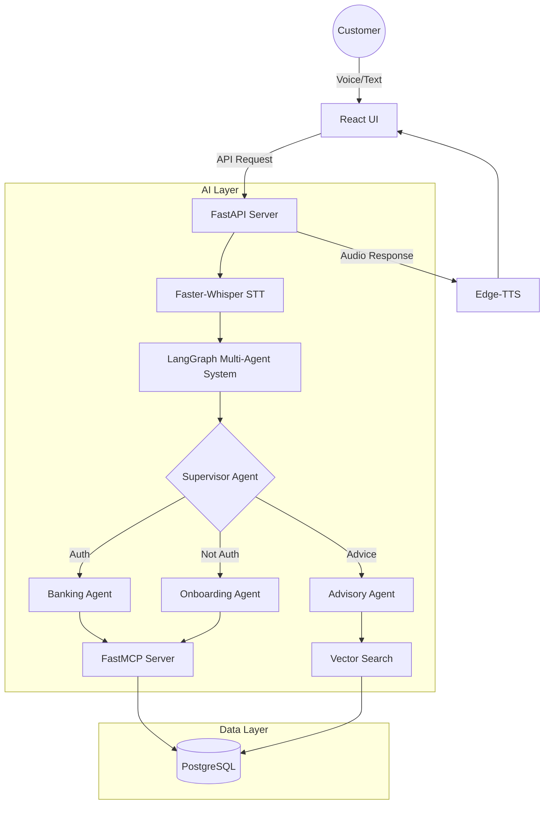

# AI Banking Multi-Agent System Walkthrough
> ## Project Name: IVA
I have successfully built a voice-enabled, multi-agent banking assistant for the OrchestrateAI buildathon. This system leverages LangChain, LangGraph, and MCP to provide a sophisticated user experience.
## Key Features
- **Voice Interaction**: Use the push-to-talk button to interact with the banking agent.
- **Secure Authentication**: Full JWT-based OAuth2 flow with Login and Registration screens.
- **Improved UI**: Fixed-height chat window with smooth auto-scrolling for better history tracking.
- **Multi-Agent Orchestration**: A supervisor agent routes requests to specialized agents for onboarding, banking, and financial advice.
- **Email Lookups**: The agent can now automatically retrieve all accounts associated with a customer's registered email.
- **MCP Integration**: The backend uses FastMCP to expose secure banking tools (balance check, transfers, applications) to the LLM.

## Snapshot
<image src="https://github.com/vish4life/IVA/blob/f4b4e1d21dcef9a93456fc3e611105c033536b34/Screenshot%202026-02-28%20at%2009.57.43.png"/>

## Technical Architecture

## How to Run

### 1. Setup Backend
```
cd backend
pip install -r requirements.txt
python database.py  # Initialize DB
python seed_rag.py  # Seed policy documents
python main.py      # Start FastAPI (port 8000)
```

### 2. Setup Frontend
```
cd backend
pip install -r requirements.txt
python database.py  # Initialize DB
python seed_rag.py  # Seed policy documents
python main.py      # Start FastAPI (port 8000)
```

### 3. Usage
* Open http://localhost:3000/.
* Enter your email and click "Log In" to access banking tools (e.g., "Transfer $500 to account AC123").
* Logout (or use a new email) to test onboarding (e.g., "I want to open a savings account").
* Ask policy questions: "How long does a cheque take to clear?".
